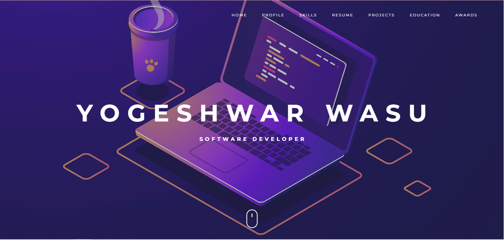
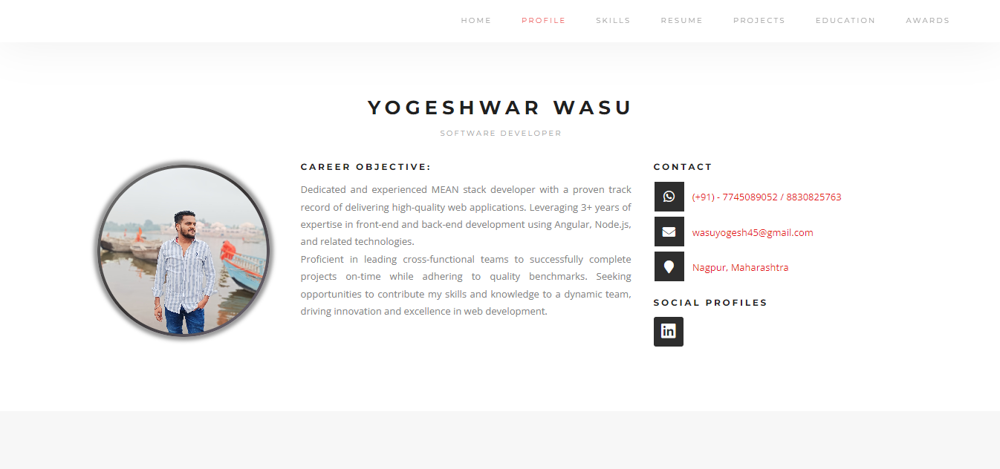

# 🚀 **CV/RESUME of Yogeshwar Wasu**  

Welcome to the personal portfolio of **Yogeshwar Wasu**! This project was built using **Angular** and is designed to showcase my skills, experience, and achievements.

## 💼 **About This Project**

This project was generated with [Angular CLI](https://github.com/angular/angular-cli) version 13.3.3 and features a clean, responsive, and modern design to present your CV/Resume online.  

Feel free to explore, and if you have any feedback or suggestions, don't hesitate to reach out!

---

## 📸 **Preview**

Here’s a sneak peek at what you can expect from the application:

  
*Responsive layout showcasing my professional journey.*

  
*A clean design with interactive features.*

---

## 🛠️ **Installation & Setup**

To get this project running locally, follow these steps:

1. Clone this repository:

    ```bash
    git clone https://github.com/yourusername/your-repo-name.git
    cd your-repo-name
    ```

2. Install the dependencies:

    ```bash
    npm install
    ```

---

## 🖥️ **Development Server**

Run the app on your local machine:

```bash
ng serve
